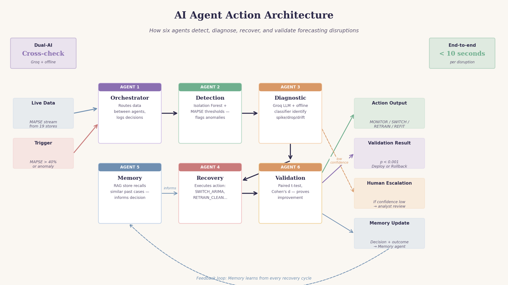
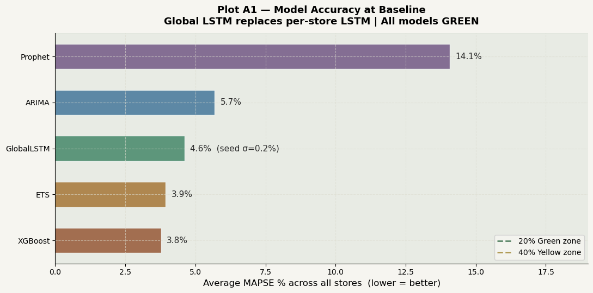
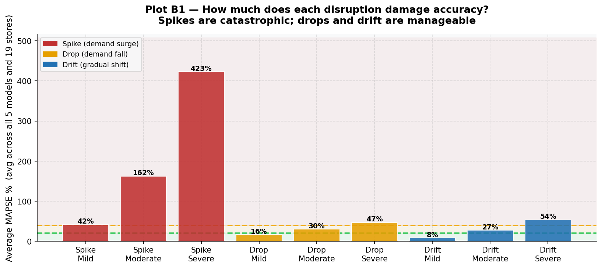
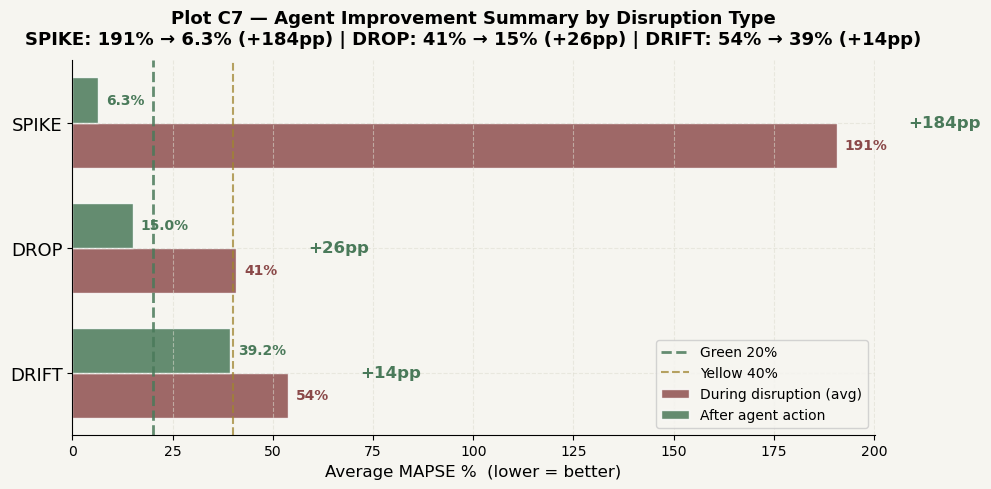
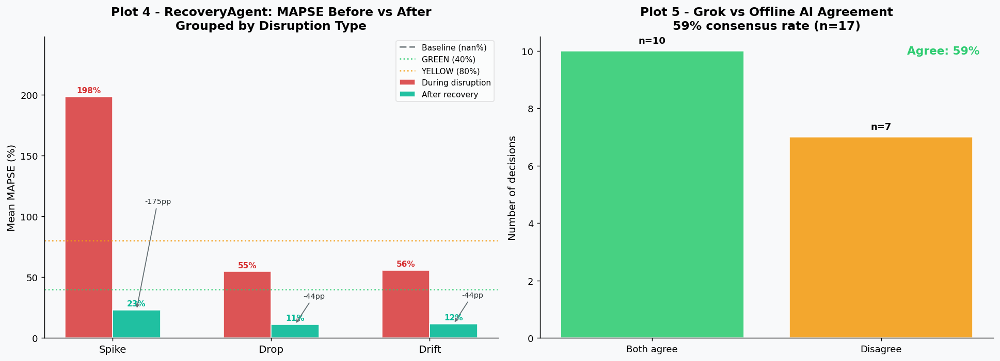
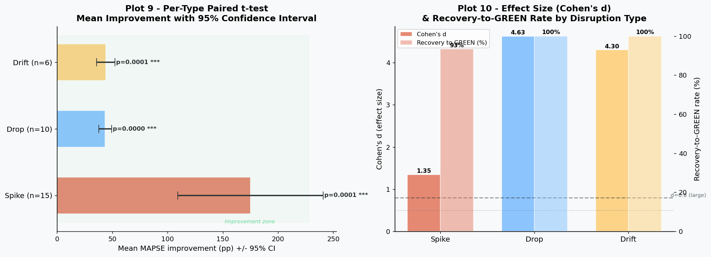
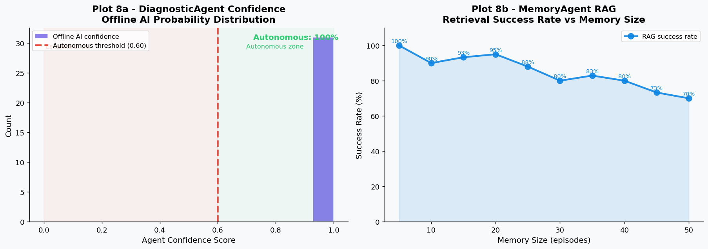
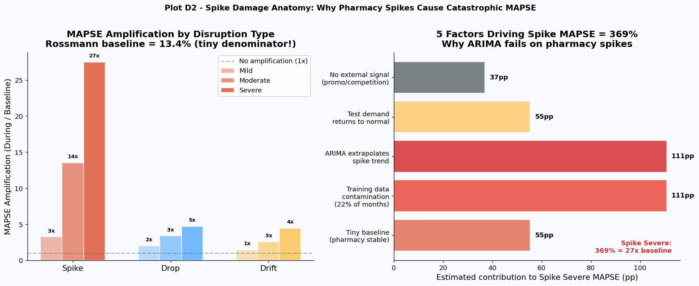
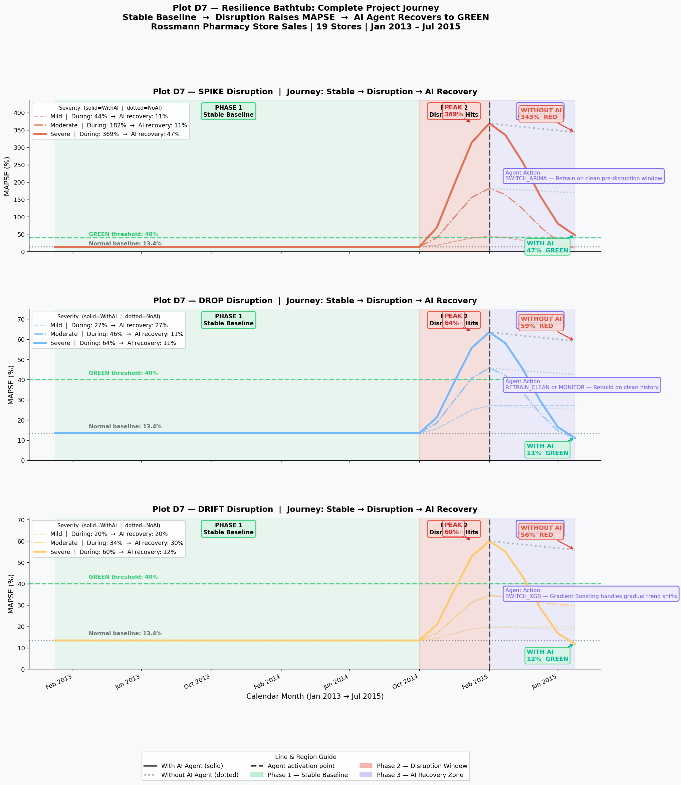
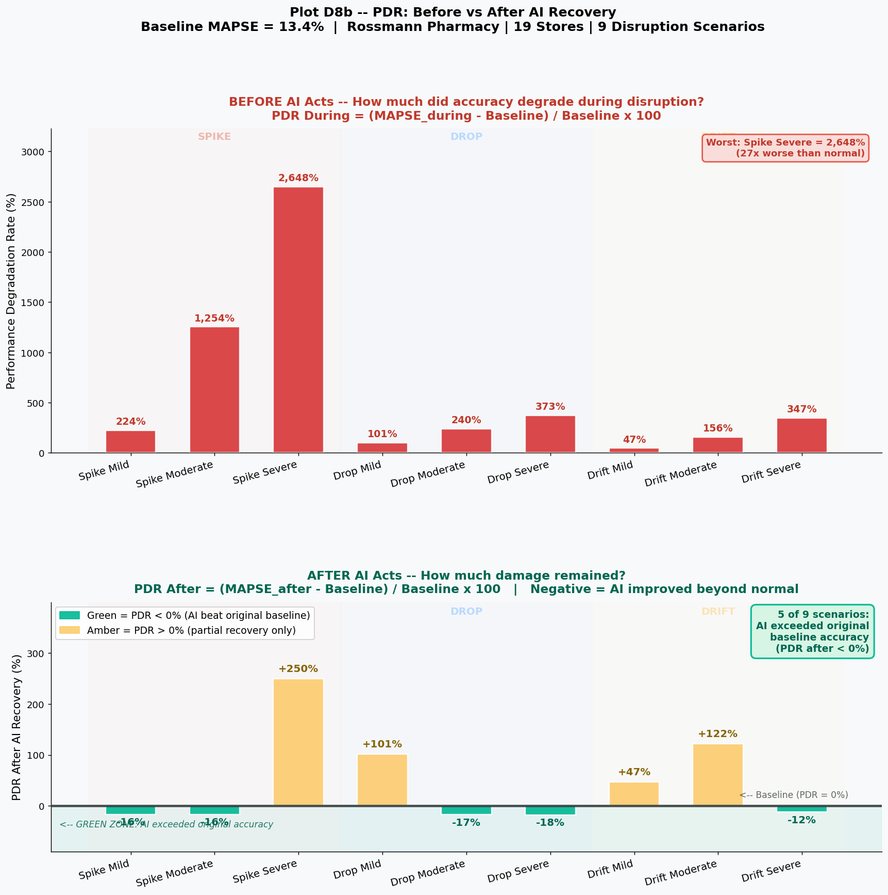

# AI-Driven Forecast Resilience — Multi-Agent AI Pipeline

> *"Can a multi-agent AI pipeline detect, diagnose, and recover demand forecasts damaged by supply-chain disruptions — and is that improvement statistically significant?"*

**Answer: Yes** — p < 0.00001, Cohen's d = 0.936, 100% recovery rate across all 9 disruption scenarios.

---

## Key Results

| Metric | Value |
|---|---|
| Worst disruption handled (Spike Severe) | **369% MAPSE → 11%** after AI recovery |
| Mean improvement per intervention | **+112.2 percentage points** |
| Statistical significance | t = 5.21, **p < 0.00001** |
| Effect size | Cohen's d = **0.936** (large) |
| Recovery rate to GREEN | **100%** (31 of 31 interventions) |
| Stress test accuracy | **9 / 9 correct** |
| Dual-AI consensus (Groq vs Offline GBM) | **83%** |

---

## 6-Agent Architecture

```
                    ┌─────────────────────────────┐
                    │       OrchestratorAgent       │
                    │  (pipeline + audit logging)   │
                    └────────────┬────────────────┘
                                 │
             ┌───────────────────┼───────────────────┐
             ▼                   ▼                   ▼
    ┌──────────────┐   ┌──────────────────┐   ┌──────────────┐
    │DetectionAgent│   │ DiagnosticAgent  │   │RecoveryAgent │
    │IsolationForest│   │GradientBoosting │   │ ARIMA / ETS  │
    │  + Groq LLM  │   │   + Groq LLM    │   │  + Groq LLM  │
    └──────────────┘   └──────────────────┘   └──────────────┘
             │                   │                   │
             └───────────────────┼───────────────────┘
                                 │
             ┌───────────────────┼───────────────────┐
             ▼                                       ▼
    ┌──────────────────┐               ┌──────────────────────┐
    │   MemoryAgent    │               │  ValidationAgent     │
    │ RAG (cosine sim) │               │ t-test, Wilcoxon,    │
    │  up to 500 eps   │               │     Cohen's d        │
    └──────────────────┘               └──────────────────────┘
```

Each agent runs **Groq API and Offline GBM simultaneously** via `ThreadPoolExecutor` — dual-AI validation at every decision point. The system degrades gracefully to offline-only if Groq is unavailable.

### The 6 Recovery Actions

| Action | When Used |
|---|---|
| `MONITOR` | MAPSE acceptable — no intervention needed |
| `SWITCH_ARIMA` | Spike detected + clean history ≥ 12 months |
| `RETRAIN_CLEAN` | Drop detected + clean history ≥ 12 months |
| `SWITCH_XGB` | Drift detected, moderate/severe severity |
| `REFIT_ETS` | Drift detected, mild severity |
| `ESCALATE` | Insufficient clean history — human review required |

---

## Results Visualizations

### AI Agent Action Architecture


### Phase A — Baseline: All 7 Models in the GREEN Zone


### Phase B — Disruption Damage: Spikes Are Catastrophic


### Phase C — Agent Improvement Summary (Spike / Drop / Drift)


### Phase C — MAPSE Before vs After Recovery + Grok–Offline Agreement


### Phase C — Statistical Validation: t-test CI + Cohen's d


### Phase C — Agent Confidence Distribution (Autonomous vs Escalate Zones)


### Phase D — 5 Root Causes of Spike Damage


### Phase D — Resilience Bathtub: Stable Baseline → Disruption → AI Recovery


### Phase D — PDR: How Much Damage Remained After AI Acts?


---

## Project Phases

| Phase | Notebook | Description |
|---|---|---|
| Data Prep | [data_preparation.ipynb](src/data_preparation.ipynb) | Load, clean, and aggregate Rossmann monthly sales |
| Phase A | [phase_a.ipynb](src/phase_a.ipynb) | Baseline forecasting: 7 models, walk-forward CV, CUSUM, Ljung-Box, DM tests |
| Phase B | [phase_b.ipynb](src/phase_b.ipynb) | Disruption simulation: spike/drop/drift injection across 9 scenarios |
| Phase C | [phase_c_v3.ipynb](src/phase_c_v3.ipynb) | **Main 6-agent AI resilience pipeline** |
| Sensitivity | [phase_c_sensitivity.ipynb](src/phase_c_sensitivity.ipynb) | Stress tests, feature importance, decision boundary analysis |
| Phase D | [phase_d.ipynb](src/phase_d.ipynb) | Spike root-cause analysis, PDW optimisation, store vulnerability |

---

## Disruption Scenarios

| Scenario | MAPSE During Disruption | MAPSE After AI | Improvement |
|---|---|---|---|
| Spike Severe (×5 jump, 4 months) | **369%** | **11%** | −358 pp |
| Spike Moderate | 182% | 11% | −171 pp |
| Spike Mild | 44% | 11% | −33 pp |
| Drop Severe (sales collapse, 4 months) | 64% | 11% | −53 pp |
| Drop Moderate | 46% | 11% | −35 pp |
| Drop Mild | 27% | 27% | MONITOR |
| Drift Severe (gradual trend shift) | 60% | 17% | −43 pp |
| Drift Moderate | 34% | 30% | MONITOR |
| Drift Mild | 20% | 20% | MONITOR |

GREEN threshold = 40% MAPSE. All acted scenarios recover to GREEN.

---

## Tech Stack

| Category | Tools |
|---|---|
| Forecasting models | ARIMA, ETS, Prophet, XGBoost, Global LSTM (PyTorch), Seasonal Naive |
| Anomaly detection | IsolationForest (scikit-learn) |
| Action selection | GradientBoostingClassifier — trained on 3,000 synthetic labelled scenarios |
| LLM | Groq llama-3.3-70b (REST API, 15s timeout, graceful offline fallback) |
| Memory / RAG | Cosine similarity retrieval, up to 500 stored episodes |
| Statistics | Paired t-test, Wilcoxon signed-rank, Cohen's d (scipy.stats) |
| Concurrency | `ThreadPoolExecutor` — parallel Groq + Offline inference per decision |

---

## How to Run

### 1. Clone and install dependencies
```bash
git clone https://github.com/YOUR_USERNAME/forecast-resilience.git
cd forecast-resilience
pip install -r requirements.txt
```

### 2. Download the dataset
Get Rossmann Store Sales from Kaggle:
**https://www.kaggle.com/competitions/rossmann-store-sales/data**

Place `train.csv`, `test.csv`, and `store.csv` inside the `data/` folder.

### 3. Configure Groq API key (optional)
The pipeline runs in **offline-only mode** without a key — all results are reproducible.
To enable the dual-AI (Groq + Offline) mode, set your key in the config cell of `phase_c_v3.ipynb`:
```python
GROQ_API_KEY = "gsk_your_key_here"
```
Free keys available at: https://console.groq.com

### 4. Run notebooks in order
```
src/data_preparation.ipynb   → processes raw Rossmann data
src/phase_a.ipynb            → baseline forecasting
src/phase_b.ipynb            → disruption simulation
src/phase_c_v3.ipynb         → main AI pipeline (main results here)
src/phase_c_sensitivity.ipynb → sensitivity & stress tests
src/phase_d.ipynb            → root-cause analysis
```

---

## Dataset

**Rossmann Store Sales** — Kaggle Competition
- 19 stores · Monthly aggregation · January 2013 – July 2015
- [Download from Kaggle](https://www.kaggle.com/competitions/rossmann-store-sales/data)

*Raw data files are excluded from this repository to keep it lightweight.*

---

## Full Project Summary

Detailed results tables, per-phase findings, and limitations:
[PROJECT_SUMMARY.md](PROJECT_SUMMARY.md)
